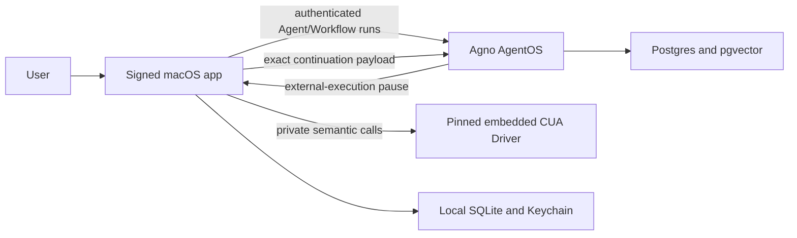

# Menso architecture

## 1. Product boundary

Menso is a native macOS companion for observing local applications and AI-agent sessions, surfacing approvals, accepting dictation/live voice, and executing narrowly typed desktop actions.

The system has two trust domains:

- The signed Mac app owns native observation, TCC permissions, credentials, target recognition, local policy, approval, audio, CUA execution, verification, audit, and idempotency.
- AgentOS owns authentication, orchestration, model calls, Agent/Workflow run state, learning state, and backend persistence.
- A model never receives raw CUA, Accessibility, shell, browser, coordinate, click, key, screenshot, or unrestricted typing tools.

## 2. Agno design

### 2.1 Reusable Agent

`menso` is the reusable public Agent for open-ended reasoning and single semantic desktop actions. It has a user-scoped Agno `LearningMachine` and the app-agnostic `MensoCuaToolkit`.

The Toolkit registers four external-execution functions:

1. `open_application(bundle_id)`
2. `focus_window(bundle_id, pid, window_title)`
3. `insert_text(bundle_id, pid, text, window_title, field_role, field_label)`
4. `activate_control(bundle_id, pid, window_title, control_role, control_label, expected_state)`

These are proposals, not capabilities. Before the run starts, the Mac captures and durably stores the exact expected target and the complete expected operation. A pause is executable only if the tool name, every authority-bearing argument, authenticated user, product session, Agent/run identity, and expiry match that record.

### 2.2 Workflows

Workflows are used for ordered server-side procedures such as reviewed agent improvement, deployment checks, and explicit eval execution. Workflow continuation remains a distinct, lossless transport contract. Generic desktop-action authority is not inferred from a Workflow requirement.

### 2.3 Learning

Personal profile, memory, session context, and proposed knowledge are scoped by verified AgentOS identity. Recalled learning is untrusted context and cannot alter tools, local policy, confirmations, targets, or permissions.

The admin-only improvement Workflow resolves evidence from owned sessions or owner-attributed evals, redacts it, requires human review, and publishes only a sanitized lesson. Source changes, schema changes, tool changes, and eval cases remain inert proposals.

## 3. Desktop action protocol

### 3.1 Authority before model execution

For a desktop-action run, the app:

1. recognizes one exact application/window/accessibility element;
2. constructs one exact semantic operation;
3. persists a launch authority bound to verified user and product session;
4. starts the Agent run;
5. binds the returned top-level run ID to that pre-existing authority.

Open-ended runs carry no desktop authority. Any CUA pause from such a run fails closed.

### 3.2 Pause handling

Only one unresolved supported external-execution tool may be active. The Swift request factory rejects model-supplied authority fields and reconstructs the `ActionRequest` from app-owned identity, target, operation, expiry, and a deterministic idempotency binding.

`PolicyEngine` returns allow, deny, or a separately represented human review. `ActionExecutor` serializes side effects and reserves the action before execution. Replays return the stored terminal result and never repeat a desktop action.

### 3.3 Private CUA adapter

The release lane embeds exactly CUA Driver 0.12.6 at a reviewed commit and binds its archive, executable, session policy, and protocol hashes. The app launches it only through the direct-child embedded responsibility chain.

The raw MCP client is private inside the host adapter. `LocalToolBroker` can obtain only `CUASemanticTransport`. Each operation uses structured pre/post reads:

- open: launch, bring to front, then prove the active bundle and process;
- focus: resolve one exact titled window, activate it, then re-read active app/window state;
- insert: resolve one exact AX text element, require the driver’s confirmed effect, then re-read the element value;
- activate: resolve one exact semantic control, perform the action, and prove the requested post-state differs or matches as required.

Transport acceptance, a screenshot, a coordinate, or an unverified click is never a successful receipt.

### 3.4 Continuations

Agent, Team, and Workflow continuation payloads remain distinct:

- Agent: preserve the complete `tools` array and mutate only the matched tool result.
- Team: preserve the rich member/requirement routing contract.
- Workflow: preserve the complete append-only `step_requirements` envelope and mutate only the active requirement.

Before POST, the app stores the exact endpoint JSON in SQLite. Retries send only that saved envelope and never re-run policy or CUA. A server `2xx` quarantines a row from same-process resend even if the local delivered mark fails.

Pinned AgentOS continue endpoints do not accept Menso’s stable delivery nonce. Therefore, a process crash after server acceptance but before the local delivered mark can repeat the continuation POST. It cannot repeat the local side effect. Full request-level exactly-once delivery requires an authenticated server acknowledgement/deduplication contract.

## 4. macOS runtime

### 4.1 Shell and observation

The app is an `LSUIElement` process with a nonactivating AppKit panel and SwiftUI content. It monitors application lifecycle and local agent telemetry without taking focus. Local cursors, action state, run authority, reviews, audit, and continuations use GRDB/SQLite.

### 4.2 Permissions

Permissions are requested only from explicit product UI. Accessibility, microphone, and Speech Recognition have separate health states. The current CUA adapter is AX-only and explicitly disables screenshots, so it does not require Screen Recording. A future visual capability would need a separate typed contract and explicit permission boundary. Unknown state fails closed. Menso never automates SecurityAgent, TCC, Touch ID, admin-password, or other OS-owned secure surfaces.

### 4.3 Dictation

The dictation hotkey records through `AVAudioEngine`, converts to 16 kHz mono Float32, and transcribes with Apple Speech configured to require on-device recognition. The app captures the exact focused editable AX target before insertion. Text insertion passes through PolicyEngine and ActionExecutor; secure input or missing observable verification blocks success.

### 4.4 Live voice

The backend mints a short-lived constrained OpenAI Realtime secret for a verified JWT with `realtime:connect`. The Mac uses native WebRTC audio and exposes one Realtime function: `delegate_to_menso`.

`operation_hint` is `open_ended` or `desktop_action`. Both route to the `menso` Agent. Realtime text cannot create authority; a desktop action requires an exact local target and operation selected in the app. Final action receipts are cross-checked against local SQLite truth before being returned to the voice session.

Reconnects use fresh credentials/provider sessions with bounded attempts and a compact untrusted continuity envelope. Prior provider call IDs are never replayed into a replacement conversation. A crash-recovered `in_flight` AgentOS delegation is not blindly resubmitted; it requires authenticated run-status reconciliation.

### 4.5 Claude Code hooks

Claude Code integration is opt-in and local. A loopback receiver accepts authenticated, bounded hook events. Permission prompts become separate local reviews and cannot invoke generic CUA or widen policy.

## 5. Backend and identity

Production AgentOS requires verified JWT identity, the expected audience, per-resource scopes, and user isolation. Request-body `user_id` is never authority. Normal tokens cannot access another user’s sessions, runs, or learnings; explicit admin scope is the only documented exception.

Provider keys stay server-side. Realtime receives only an ephemeral client secret. Secrets, raw CUA evidence, screenshots, audio, coordinates, and unredacted third-party content are excluded from model learning and logs.

The Studio registry exposes no CUA tools. AgentOS resource discovery must not turn internal Toolkit instances into public mutable capabilities.

## 6. Distribution

Swift package revisions and the CUA release are pinned. Release CI builds before materializing signing secrets, assembles nested frameworks/helpers, signs inside-out, notarizes and staples the app and DMG, then generates a signed Sparkle appcast. Missing artwork, keys, hashes, permissions, or trust metadata fails the release.

## 7. Completion criteria

Source implementation is complete only when:

- model-visible desktop tools are typed Agno external-execution functions;
- every executable pause has pre-existing app-owned target and operation authority;
- local policy, review, audit, idempotency, execution, and observable verification are composed;
- Agent and Workflow continuation envelopes remain exact and distinct;
- dictation and voice preserve verified identity and local action authority;
- learning is scoped, reviewable, and deletable;
- missing configuration or evidence disables execution rather than weakening the boundary.

Builds, tests, signing, deployment, and live exercises are separate validation work and are not run without explicit user authorization.
