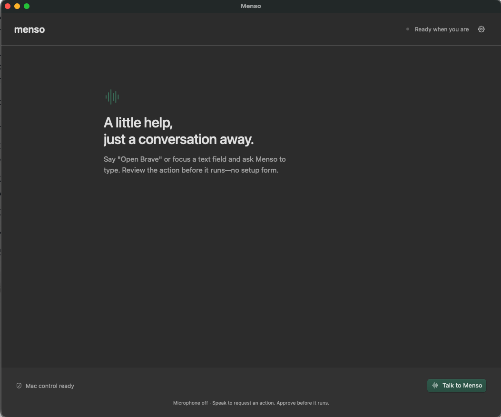

# Menso

Menso is a native macOS desktop assistant: describe a task, let the Mac carry out supported steps, and see the verified results.



The app has one resizable window with live captions, a start/end voice control, action approvals, and results. The source task runner refreshes native context after each verified step and continues the original request without requiring a separate voice command for each step. Opening/focusing apps runs automatically; text insertion and control changes still require native approval. Supported operations remain opening an app, focusing a known window, inserting exact text without submitting, and setting a focused control. This is not yet unrestricted computer use.

Voice uses OpenAI `gpt-live-1` with client delegation. TypeSafe `jev-latest` selects the next candidate from fresh native context and verified task progress. There is no Agno agent in the active action path. The signed Mac owns microphone access, the task loop, exact targets/text, policy, approvals, execution, and verification. Provider keys stay on the backend. AgentOS remains only as the existing authenticated HTTP/database host.

## How it works

```text
Your voice → GPT-Live → original task sent to the Mac
                              ↓
       Observe → TypeSafe selects next step → local policy
          ↑                                       ↓
          └──── verified result ← CUA execution / review
                              ↓
                 Completion or partial failure → GPT-Live
```

The Mac supplies known apps and the focused window/control as request-scoped metadata. TypeSafe returns a candidate ID, stops for clarification/unsupported work, or signals completion. Completion is accepted only after locally verified execution receipts exist; the spoken summary lists those verified steps. It does not generate executable code or arbitrary tool arguments. Only the Mac can create an approval card and execute an action.

## App code architecture

<details>
<summary>Desktop UI and dependency wiring — Swift / SwiftUI / AppKit</summary>

- `macos/Sources/MensoApp/AppDelegate.swift`: creates the desktop window and wires the authenticated runtime, TypeSafe selector, voice coordinator, and embedded CUA host.
- `AppModel.swift` and `Views/MensoRootView.swift`: UI state, captions, start/end conversation, native review cards, and results. No provider tools execute from a view.
- `MensoCore/Runtime/TrustedRuntime.swift`: shared local policy, audit, persistence, and executor dependencies.

</details>

<details>
<summary>Voice and task loop — owned by the Mac, not an Agno agent</summary>

- `MensoCore/Voice/OpenAILiveWebRTCSession.swift`: native WebRTC audio, fresh transcript delegation, and short progress/result messages to GPT-Live.
- `TypeSafeVoiceDelegationBridge.swift`: one active task, fresh observations before each step, identity rechecks, an eight-step cap, and a three-minute deadline checked between operations. Driver replies have a separate 30-second timeout. Ending the conversation cancels remaining work; already executed changes are not rolled back.
- `TypeSafeActionSelector.swift`: builds exact local action candidates and calls authenticated `/menso/actions/next` with the original task and verified completed-step descriptions.
- `VoiceActionContext.swift`: observes installed/running app identities and the focused native target. Raw screen/page content is not sent to TypeSafe.
- Repeated exact steps and overlapping tasks are refused. Failed or uncertain steps stop the loop; mutations are not automatically retried. Partial receipts remain available.

</details>

<details>
<summary>CUA integration — Swift host → bundled native driver over private MCP</summary>

**CUA is local, not a backend integration, and not a linked Swift CUA SDK.** `PinnedEmbeddedCuaDriverHost.swift` launches the pinned native `cua-driver` executable bundled at `Menso.app/Contents/Helpers/cua-driver` as a direct child of the signed app.

The Swift host creates a private Unix socket for the embedded daemon and a private stdio MCP client. Its semantic adapter calls the driver's native tools (`launch_app`, `bring_to_front`, `list_apps`, `list_windows`, `get_window_state`, and bounded input operations). `LocalToolBroker.swift` accepts only typed actions and verifies the returned identity/content/evidence. Raw MCP is not exposed to a model or the network.

The packager verifies the upstream driver pin before signing, records its post-signing checksum, and seals that checksum in the signed app. Runtime verifies the resource seal, helper checksum, and signed-host permission attribution. The backend never launches the driver or controls the desktop.

There are no browser-specific tab-bar parsers or hard-coded per-app New Tab controls. CUA's native browser tools require their own exact binding and setup contract. In the pinned `0.12.6` release, the documented native browser tool list has no dedicated new-tab operation; existing-profile setup does not support Brave. The current Menso policy does not enable that browser tool family. Native browser integration remains unfinished—not a capability implied by having CUA installed.

References: [pinned CUA tool contract](https://github.com/trycua/cua/blob/9eb1f481b8a12cd6ffda2ad5af21653a9e5aa9e5/docs/content/docs/reference/cua-driver/mcp-tools.mdx), [existing-profile attachment requirements](https://github.com/trycua/cua/blob/9eb1f481b8a12cd6ffda2ad5af21653a9e5aa9e5/docs/content/docs/reference/cua-driver/browser-profile-attachment.mdx).

</details>

<details>
<summary>Backend — authentication, GPT-Live setup, and TypeSafe selection</summary>

- `backend/app/live.py`: authenticates the Mac's SDP offer and negotiates GPT-Live; the OpenAI key stays server-side.
- `backend/app/actions.py`: `/menso/actions/next` uses TypeSafe Choice to propose the next existing catalog ID or stop. `/menso/actions/select` remains for older single-action clients. Both derive identity from verified JWTs.
- The response grants no desktop authority, approval, or execution receipt. Local policy is still required even after HTTP 200.
- AgentOS hosts HTTP/auth/database compatibility only. No Agno agent plans or executes the active voice tasks.

</details>

<details>
<summary>Local policy, verification, and storage</summary>

`PolicyEngine.swift` creates exact, expiring action-ID/content/target-bound permissions. Only native open/focus navigation can run without review; text/control changes retain approve-once review through `RunPauseCoordinator`. `ActionExecutor.swift` enforces secure-input state, durable audit and idempotency reservations before execution. SQLite stores terminal results and evidence references.

An unverified result is not proof that nothing happened. Driver tool refusals and protocol failures now have distinct error codes, and local CUA diagnostics log the fixed failing tool name without provider bodies or user content. The voice adapter explicitly warns against converting uncertainty into “nothing ran.”

</details>

## Current scope

| Supported in source | Not supported |
| --- | --- |
| Live voice conversation and captions | Screen reading or screenshots |
| Open or bring an installed app forward | Arbitrary clicks, shell commands, or browser automation |
| Continue a bounded sequence of supported operations | Arbitrary multi-step tasks outside the semantic catalog |
| Insert exact dictated text without submitting | Generating drafts or composing text for insertion |
| Change a known focused control to a supported state | General-purpose control of every Mac interface |
| Automatic navigation; review writes; retain partial verified results | Native browser tab/page automation and automatic replay after quitting |

Action proposals expire after three minutes. Local execution receipts remain in SQLite; a conversation reconnect does not replay an old action. A new request after an uncertain outcome can repeat the intended action, so inspect the target app before retrying.

## Local setup

Requirements: macOS 14+, a Swift 6 toolchain, Docker Compose, an OpenAI project with GPT-Live access, and a TypeSafe API key. The local JWT helper also expects Homebrew OpenSSL at `/opt/homebrew/bin/openssl`.

### 1. Configure the backend

Create `backend/.env` from [backend/example.env](backend/example.env) if it does not exist. Preserve an existing file and its secrets. Configure:

| Variable | Purpose |
| --- | --- |
| `OPENAI_API_KEY` | Server-side OpenAI key with GPT-Live access |
| `TYPESAFE_API_KEY` | Server-side TypeSafe key for action selection |
| `OPENAI_LIVE_MODEL` | Defaults to `gpt-live-1` |
| `TYPESAFE_MODEL` | Defaults to `jev-latest` |
| `MENSO_SAFETY_IDENTIFIER_SALT` | Private, randomly generated salt of at least 32 characters |
| `DB_PASS` | Database password; preserve the password of an existing database |

Provider keys, local JWTs, and signing material must stay out of Git. For local authenticated setup, run from the repository root:

```sh
zsh backend/scripts/generate_local_auth.sh
docker compose --project-directory backend -f backend/compose.yaml up --build -d
```

The helper creates ignored development credentials, valid for 24 hours by default. Compose loads the generated public JWKS configuration; debug Mac builds can read the local token. Production requires a trusted JWT issuer and asymmetric verification—see [backend setup](backend/README.md).

If the database is already running and only API configuration changed, recreate just the API container:

```sh
docker compose --project-directory backend -f backend/compose.yaml up -d --build --force-recreate --no-deps menso-api
```

### 2. Build and install the Mac app

For an Apple Silicon debug build, from the repository root:

```sh
zsh macos/scripts/fetch-cua-driver.sh
swift build --package-path macos --arch arm64
zsh macos/scripts/package-debug-app.sh
open macos/.build/local-app
```

Packaging requires the pinned CUA driver at `macos/Resources/CuaDriver/cua-driver`, which is intentionally not committed. The [driver fetch script](macos/scripts/fetch-cua-driver.sh) documents its inputs. See [Mac setup](macos/README.md) for packaging and release details.

Quit the existing Menso app, move the newly packaged `Menso.app` into `/Applications`, and launch that copy. Running an older installed copy does not pick up source changes. Replacing an ad-hoc signed build may require granting macOS permissions again.

### 3. Use Menso

Start a conversation and allow microphone access. Enable Mac control and grant Accessibility when requested. In the task-loop source revision, “Open Brave” runs as navigation without an approval card. Text insertion and control changes still show Approve or Decline. End conversation stops remaining task steps. No preparation form is needed. Rebuild the Mac app and update the API together for `/menso/actions/next` support.

Release builds use Settings for the backend URL and product credentials. Existing `live:connect` credentials also authorize action selection; `actions:select` permits selection without voice. `agents:menso:run` is no longer needed. Old `realtime:connect` tokens must be reissued by the trusted issuer.

## Repository

- `macos/`: AppKit/SwiftUI desktop app and trusted local execution.
- `backend/`: TypeSafe selection, GPT-Live session negotiation, verified JWT authentication, and retained Postgres state.
- [Architecture](ARCHITECTURE.md): trust boundaries and the voice/action flow.
- [Implementation status](docs/IMPLEMENTATION_STATUS.md): source changes and outstanding runtime validation.
- [Security](docs/SECURITY.md): authority and continuation invariants.

The floating widget, app/process monitoring, coding-agent dashboards, Claude hooks, dictation, learning management, and scheduled workflows have been removed. Historical SQLite tables and action wire variants are retained for data compatibility; nothing collects new monitoring data.

## Validation status

The preceding single-action revision passed 18 targeted Swift tests and was rebuilt/reinstalled; VS Code opening and verification was confirmed by the user. The new task loop, cancellation changes, and error handling in this revision are **source-only and have not been tested, built, or installed**. Native browser automation remains unfinished. Earlier results do not validate this revision. See [implementation status](docs/IMPLEMENTATION_STATUS.md).

The commands above are instructions, not evidence that setup or validation has succeeded. Repository contributors must obtain explicit user authorization before running tests, builds, linters, formatters, validation scripts, or live checks.

## License

Menso is licensed under the [MIT License](LICENSE). Third-party dependencies retain their respective licenses.
